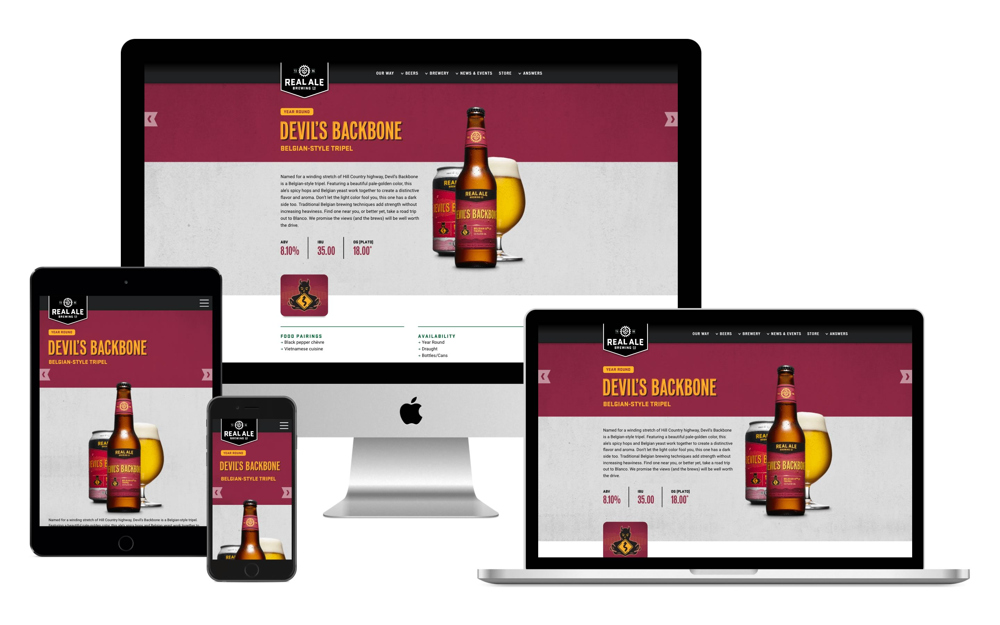

# Respond

Need to show off some of your responsive work to some co-workers or clients?  Don't want to spend a bunch of time Photoshopping?  No problem!

Try it out at [showrespond.com](http://showrespond.com/).  Put in your site or something like mediaqueri.es to see it in action.

#### If it won't load...

Some external sites (especially on HTTPS) such as banks, Google, Apple, Microsoft and Yahoo won't allow themselves to be embedded into other sites.  If Respond isn't working for your site, you need to put a copy of it onto the same server and / or domain and protocol (HTTP / HTTPS).

#### Optimal Screenshot Size

There is page scaling in addition to device scaling so everything fits in your browser window.  The unscaled page of this tool is 1440x900, which is the size of a 15" Macbook Pro.  This is probably the best size to do screenshots (especially for iPhone only view) so the pixels are really tight.  If you do this, make sure the browser is in full screen mode with no URL bar or bookmarks showing.

#### Scrollbars

Scrollbars are a bit tricky because your OS may show them, but they shouldn't be in the tool.  The short-term solution is to turn off scrolling by default so it isn't a visual eyesore.  Opting in is no problem for tablets and Mac OS without scrollbars, but will cause visual discrepancies on Windows.  A subsequent version of the tool can fake this, but it's tedious.  If there are any volunteers, feel free to fix it!

## Code

Respond's code has no external dependencies for HTML, CSS, JavaScript or UI components – and uses no build tools.  It is namespaced so you can easily clone and port it into internal tooling without any conflicts.  The idea is that anyone can pick it up and modify it for their use.

## Feature Requests

Feel free to do some updates and ping me about getting it merged in.  Future updates may include:

- Multiple ecosystems such as Windows, Android, etc.
- Allowing scrolling while hiding the OS / device scrollbars
- Update devices to be cleaned-up SVGs instead of high-res PNGs
- Make Respond available as a browser plugin / app

## Attribution

- This is based upon the concept of [Am I Responsive?](http://ami.responsivedesign.is/), but has various feature differences listed above.
- The devices and icons were harvested from various files at [Sketch App Resources](https://www.sketchappsources.com/).

## Contact

Hit me up at [@_ianrichard](https://twitter.com/_ianrichard).